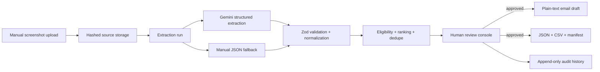

# CRM Feed: Engineering Overview

> A human-in-the-loop multimodal intake system that converts manually supplied screenshots into validated, reviewable, CRM-ready records without scraping or inventing data.

## At a glance

| Area | Implementation |
| --- | --- |
| Product | Screenshot intake, AI extraction, human review, deterministic qualification, email drafting, and verified export |
| Core stack | TypeScript, React, Vite, Express, Gemini multimodal, Zod, Vitest |
| Architecture | npm workspace monorepo with shared contracts, API orchestration, atomic local persistence, and a review UI |
| Safety model | Schema validation, explicit failure categories, provenance, human approval, company scoping, and export-only CRM boundary |
| Runtime | Local-first; Gemini is optional and manual structured import remains available |

## Why this project is technically interesting

CRM Feed sits at the difficult boundary between probabilistic AI output and business data that must be deterministic, explainable, and approved. The design does not allow a successful model call to become a trusted CRM record automatically.

- **Structured multimodal extraction.** Gemini receives image bytes and a versioned prompt, returns JSON under a response schema, and the application validates the result again with Zod.
- **No invented success.** Missing credentials, timeouts, malformed JSON, schema mismatches, empty results, and provider failures become explicit states. Failed extraction creates no people.
- **Human approval remains authoritative.** AI extraction cannot bypass the review queue. Latest-review-wins semantics determine whether a person can enter an email or export.
- **Deterministic business rules.** Eligibility, ranking, deduplication, company inference, and email formatting live in shared TypeScript modules with focused tests.
- **Provenance without source leakage.** Screenshots, hashes, extraction attempts, raw responses, and audit records remain internally traceable while recipient-facing email drafts omit extraction language.
- **Honest integration boundary.** Without a live CRM API, the system produces JSON, CSV, and a hash-bearing manifest and records the result as `exported`, never `synced`.

## System shape



The database and API remain the source of truth. A future agent layer may orchestrate existing endpoints, but it is deliberately not allowed to own canonical CRM data or bypass approval gates.

## Guided code tour

1. **`apps/api/src/extraction/gemini.ts`**
   Provider abstraction, structured Gemini request, timeout/error classification, JSON parsing, and schema enforcement.
2. **`packages/shared/src/schema/extraction.ts`**
   Canonical extraction contract shared by AI and manual-import paths.
3. **`packages/shared/src/rules/`**
   Deterministic company inference, eligibility, ranking, normalization, and versioned rules.
4. **`packages/shared/src/review/`**
   Latest-decision projection, selection, and deduplication logic.
5. **`apps/api/src/store/atomicStore.ts`**
   Local persistence boundary used by the API collections.
6. **`apps/api/src/routes/`**
   Upload, extraction, review, email, export, audit, health, intake, and master-data endpoints.
7. **`apps/web/src/App.tsx`**
   Operator workflow for companies, batches, extraction, review, diagnostics, audit, and export.
8. **`apps/api/tests/` and `packages/shared/tests/`**
   API, extraction, safety, ranking, review, and production-readiness tests.

## Engineering decisions worth discussing

### 1. AI suggests; deterministic code decides

The model extracts candidates and confidence. Eligibility and ranking are computed in versioned code, and approval is a separate human action. This keeps business policy testable and prevents prompt changes from silently changing CRM write behavior.

### 2. Failure states are first-class data

Each attempt records status, error category, retry count, timestamps, model, prompt version, and schema version. The UI can therefore explain why a record is absent instead of presenting an empty screen or fabricated fallback.

### 3. Latest review decision wins

Review history is retained, but exports and emails project one deterministic current decision. A later rejection correctly overrides an earlier approval, which is safer than treating approval as irreversible.

### 4. Export is a real contract

The export path is company-scoped, idempotency-aware, and verifiable through file hashes. It is a deliberate adapter boundary for a future CRM integration rather than a placeholder success message.

## Verification

Use a clean checkout and build the shared workspace before the full suite:

```bash
npm ci
npm run lint
npm run typecheck
npm run build
npm test
node scripts/data-integrity-check.mjs
node scripts/no-secret-scan.mjs
node scripts/verify-exports.mjs
node scripts/verify-backup.mjs
```

The current public snapshot contains focused shared and API test suites covering extraction schemas, error classification, company inference, eligibility, ranking, review projection, bulk intake, audit behavior, and export hardening.

## For coding agents

1. Read `docs/MASTER_SPEC.md` before changing behavior.
2. Treat `packages/shared` schemas and rules as the policy source of truth.
3. Never create a path that bypasses company scoping, latest-review projection, or explicit approval.
4. Keep AI provider code behind `IExtractionProvider` so tests can run without credentials.
5. Preserve screenshot provenance internally and keep it out of recipient-facing text.
6. Do not claim CRM sync, ADK orchestration, deployment, or live extraction unless current evidence proves it.

## Current boundaries

- Intake is manual; the application does not scrape or automate LinkedIn.
- The public snapshot is local-first and has no live CRM sync or email sending.
- ADK orchestration is a documented future boundary, not an implemented feature.
- Live Gemini extraction requires operator-supplied credentials and should be verified separately from the credential-free test provider.
- The public snapshot currently has no GitHub Actions workflow; local verification commands are the available proof surface.

## What this repository demonstrates

CRM Feed demonstrates a practical pattern for trustworthy AI applications: use models for interpretation, validate every boundary, keep deterministic policy in code, preserve provenance, require human approval, and report incomplete integrations honestly.
