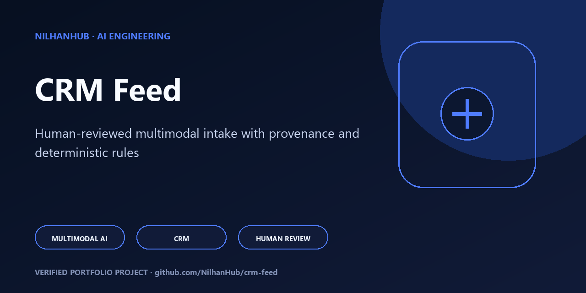

# CRM Feed

<!-- portfolio-flagship -->
<p align="center"></p>

> **Portfolio review path:** Start with the capabilities and architecture below, then reproduce the documented verification commands. See [SECURITY.md](SECURITY.md), [CONTRIBUTING.md](CONTRIBUTING.md), and [RIGHTS.md](RIGHTS.md) for the project's operating and reuse boundaries.

Convert **manually uploaded LinkedIn screenshots** into reviewed, CRM-ready company/contact/route data, and produce clean email drafts for Paul that never reveal the screenshot/OCR/extraction source.

> [!TIP]
> **Evaluating this project?** Read the [Engineering Overview](ENGINEERING_OVERVIEW.md) for the multimodal AI architecture, deterministic safety model, guided code tour, verification commands, and honest implementation boundaries.

## What this app does
- Nilhan uploads LinkedIn screenshots into a batch for a target **Company**.
- Screenshots are stored **permanently** under `data/uploads` (sha256-hashed).
- An **ExtractionRun** is recorded for a batch. Extraction can proceed via two paths:
  - **Gemini extraction (Round 3+):** If `GEMINI_API_KEY` is configured, screenshots are sent to Google Gemini with a structured output prompt. The response is validated against a Zod schema. On success, `ExtractedPerson` + `MutualContact` + `EligibilityDecision` rows are materialised. On failure, a clear error category is recorded and no people are invented.
  - **Manual JSON import (fallback):** A real extraction JSON payload (per `docs/SCREENSHOT_EXTRACTION_SCHEMA.md`) can be attached to a run; it is validated with Zod and materialises the same entity types.
- Deterministic **eligibility** and **ranking** rules (real code in `packages/shared`) decide who is email-eligible.
- Nilhan reviews people on the web UI (approve/reject). Confidence scores (0–1) from the extraction provider are displayed on review cards.
- Only **approved, currently-at-target, named-mutual** people feed the plain-text **EmailDraft**.
- With no live CRM API, the app writes a real **export contract** (JSON + CSV + manifest under `data/exports`) — it never pretends to sync.

## What Round 3 includes
- Monorepo (npm workspaces): `apps/web`, `apps/api`, `packages/shared`.
- Full spec & governance docs under `docs/`.
- `packages/shared`: shared types, Zod schemas, deterministic eligibility + ranking, email formatter, **extraction schema (Gemini + manual), error classification, confidence scoring, Gemini normalizer**, unit tests.
- `apps/api`: Express + TypeScript with **real local persistent storage** (atomic JSON store under `data/db`), screenshot upload, extraction-run create, **Gemini extraction service with structured output**, real payload attach, review decisions, email draft generation, export contract, **extraction endpoints (extract-one, extract-batch, retry, attempt history)**, **raw response audit storage**, health endpoint.
- `apps/web`: React + Vite + TypeScript premium UI — company selector/create, batch upload, screenshots list, extraction status, **Gemini extraction controls (per-shot extract/retry, batch extract, attempt history, confidence display, provenance labels)**, review queue (real records only), email draft preview.
- Email formatter + tests enforcing all rules.
- Evidence folder + ZIP.

## What is intentionally NOT implemented yet
- **No Google Cloud Vision / Document AI OCR backup.** Deferred. Gemini multimodal is sufficient for LinkedIn screenshots.
- **No ADK agents.** Extraction lives in the Express API service layer. ADK orchestration is a future goal (Round 4). See `docs/AGENT_WORKFLOW.md`.
- **No live CRM sync.** The export contract is the only write path. `CrmSyncRecord.status` is `exported`, never faked `synced`.
- **No email sending.** Drafts only.
- **No LinkedIn scraping or browser automation** — ever.

## Gemini extraction setup

### Required
- `GEMINI_API_KEY` — Gemini API key from [Google AI Studio](https://aistudio.google.com/apikey) under `nilhan.dev@gmail.com`.

### Optional
- `GEMINI_MODEL` — model to use (default: `gemini-2.0-flash`)
- `GEMINI_TIMEOUT_MS` — request timeout (default: 30000)
- `GEMINI_MAX_RETRIES` — max retries for transient failures (default: 2)

Copy `.env.example` to `.env` and fill in values. **Never commit `.env`.**

### How missing credentials behave
If `GEMINI_API_KEY` is not set:
- The extraction run status is `pending_credentials`.
- The error category is `missing_credentials` with a clear message.
- **No fake extraction is performed.** The app does not invent people.
- The manual payload attach endpoint remains available as a fallback.
- All other app functionality (upload, review, email, export) works normally.

### How to run extraction
1. Create a company and batch via the web UI.
2. Upload screenshots (PNG/JPG/WEBP/GIF) to the batch.
3. Click **Create run** to create an extraction run.
4. In the **Gemini Extraction** section, click **Extract** on individual screenshots or **Extract all** for the batch.
5. Review extracted people in the review queue. Confidence scores and provenance are displayed.
6. If credentials are missing, use the **Manual JSON payload** textarea to attach a structured JSON payload as fallback.

### No-scraping policy
This app does **not** scrape LinkedIn, automate a browser, or access LinkedIn automatically. Intake is **manual screenshot upload only**. Original screenshots are stored permanently with sha256 provenance.

## Quick start
```bash
npm install          # install all workspaces
npm run dev          # start api (:8787) + web (:5173) together
npm run build        # build shared, api, web
npm run test         # run vitest unit tests
npm run typecheck    # tsc --noEmit across workspaces
npm run lint         # eslint
```
Open http://localhost:5173. The API health check is at http://localhost:8787/api/health.

## Running the app
```bash
npm install          # install all workspaces
npm run build        # build shared, api, web
# start the API (from apps/api)
cd apps/api && npm start
# start the web UI (from apps/web)
cd apps/web && npm run dev
```
The API listens on `:8787`; the web UI is served on `:5173`.

## Running all checks
```bash
npm run lint
npm run typecheck
npm run test
npm run build
node scripts/data-integrity-check.mjs
node scripts/no-secret-scan.mjs
node scripts/verify-exports.mjs
node scripts/verify-backup.mjs
```

## Backup
Create a local backup (timestamped folder + SHA-256 manifest):
```bash
node scripts/backup-data.mjs
```
Verify a backup:
```bash
node scripts/verify-backup.mjs
```
See `docs/BACKUP_AND_RESTORE.md` for the full create/verify/restore procedure and retention notes.

## Export verification
Verify that exports are company-scoped, latest-approved-only, exclude vague-mutual-only people, and that file hashes match the manifest:
```bash
node scripts/verify-exports.mjs
```

## Health check
`GET /api/health` returns comprehensive diagnostics: app version, git commit, rules/schema/prompt versions, storage writability, Gemini status, and DB counts. Use it to confirm the app and its dependencies are healthy.

## Gemini missing-key behavior
Without `GEMINI_API_KEY`, extraction returns a `missing_credentials` error, creates **0 people**, and the app stays healthy. No fake extraction is performed; the manual JSON payload attach path remains available as a fallback.

## No scraping policy
This app does **not** scrape LinkedIn, automate a browser, or access LinkedIn automatically. Intake is **manual screenshot upload only**. Original screenshots are stored permanently with sha256 provenance.

### Manual end-to-end flow
1. Create a company in the sidebar.
2. Create a batch for that company.
3. Select the batch and upload screenshots (png/jpg/webp/gif).
4. Click **Create extraction run** (it will show `pending_credentials`).
5. Attach a real extraction JSON payload (see `docs/SCREENSHOT_EXTRACTION_SCHEMA.md`) to materialise people.
6. Review people (approve/reject).
7. Generate the email draft and/or export approved records.

## Identity lock
All Google, Firebase, GCP, Gemini, ADK, and Hostinger resources must be owned/configured **only** through **nilhan.dev@gmail.com**. No other Google identity. No cloud resources are created in Round 1. See `docs/IDENTITY_LOCK.md`.

## No-scraping policy
This app does **not** scrape LinkedIn, automate a browser, or access LinkedIn automatically. Intake is **manual screenshot upload only**. Original screenshots are stored permanently with sha256 provenance.

## Evidence policy
Each round produces an `Evidence/` folder (initial/final tree + git status, commands run, test/build output, phase notes, files changed) and a verification ZIP. See `docs/EVIDENCE_REQUIREMENTS.md`.

## Next phases
- **Round 4:** ADK orchestration over the database (DB stays source of truth), production hardening, cloud deployment under `nilhan.dev@gmail.com` only. See `docs/ROUND_4_PRODUCTION_GOOGLE_ADK_PLAN.md`.

## Layout
```
apps/web        React + Vite UI
apps/api        Express API + atomic JSON persistence
packages/shared types, Zod, eligibility, ranking, email formatter
docs            spec & governance
data/uploads    permanent screenshot storage
data/db         atomic JSON collections (local dev persistence)
data/exports    CRM export contract files
Evidence        per-round evidence
scripts         operational helpers
```
